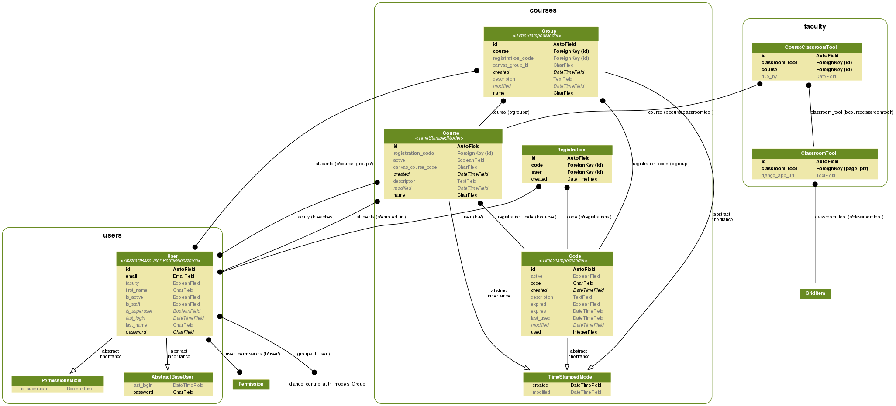

# A CentOS 7.3 Vagrant Box with Python 3.5 via Ansible
* Apache 2.4, with mod_wsgi (Django)
* FreeTDS drivers for MS SQL Server
* PostgreSQL Drivers & Server
* Node + npm

This repository contains a CentOS 7.2 box for Vagrant. Python 3.5.3 is installed alongside the system Python (2.7.5). The Vagrant config uses a bootstrap.sh script, meant to illustrate steps for getting a development environment, with modules in a self-contained directory thanks to virtualenvwrapper.

MS SQL is also supported as a Django database backend with the FreeTDS ODBC Driver to SQL Server. PostgreSQL 9.5, including the server, can be install optionally for those using PostgreSQL.

Django versions 1.8 and greater are supported. Python 3.5 was first supported in Django 1.8. Django 1.8 is an LTS (Long Term Support) release, meaning it will be actively supported with bug fixes and security patches until at least April, 2018 (and probably longer): https://www.djangoproject.com/download/#supported-versions

## Compatibility

* Tested with Vagrant 1.9.1:
    * Mac: https://releases.hashicorp.com/vagrant/1.9.1/vagrant_1.9.1.dmg
    * Windows: https://releases.hashicorp.com/vagrant/1.9.1/vagrant_1.9.1.msi
* Tested with VirtualBox up to 5.0.24:
    * Mac: http://download.virtualbox.org/virtualbox/5.0.24/VirtualBox-5.0.24-1083.6-OSX.dmg
    * Windows: http://download.virtualbox.org/virtualbox/5.0.24/VirtualBox-5.0.24-1083.6-Win.exe
* Tested on: OS/X Yosemite, and El Capitan. MS Windows 7, 8, and 10.
* Windows note: we recommend using with Git Bash: https://git-for-windows.github.io/
    * In Git Bash, click the diamond shaped multi-colored upper left icon, OPTIONS. You may want to go through the option list to increase your default window size, set up copy/paste shortcuts, and set up mouse selection for copy/paste.

## Get Started

* Windows: on newer machines, ensure that you have virtualization enabled in BIOS (Google it for your machine's model).
* Install Virtualbox https://www.virtualbox.org/wiki/Downloads
* Install Vagrant http://www.vagrantup.com/downloads
* Install git http://git-scm.com/downloads (Mac) or Git Bash https://openhatch.org/missions/windows-setup/install-git-bash (Windows)
* Create and add a public SSH key to your git server.

Verify that your SSH keys are active:

```
                    $ eval $(ssh-agent)
(Windows Git Bash): $ ssh-add C:/Users/[username]/.ssh/id_rsa
             (Mac): $ ssh-add ~/.ssh/id_rsa
                    $ ssh-add -l
```

Make a copy of the repo and bring up the virtual development environment. The "vagrant up" command will take a little while:

``` bash
$ git clone https://github.com/wharton/python-vagrant-centos7.git
$ cd python-dev-centos7
$ vagrant up
$ vagrant ssh
```

## Specifying a Host Name

By default, the host name will be set to `vagrant.example.com`. You can specify a host name like this:

``` bash
$ VAGRANT_HOSTNAME="vagrant.my.domain.com" vagrant up
```

## Try out Django:

``` bash
           **********IMPORTANT!**********
(0) On your host machine, add the following to the hosts file:
    192.168.99.100	vagrant.example.com
    Mac hosts file location: /private/etc/hosts
    Windows hosts file location: %SystemRoot%\system32\drivers\etc\hosts

(1) SSH into your Vagrant guest VM for further instructions (type "menu" to bring them up again if you need them):
    $ vagrant ssh
    $ menu
```

Shutting it down:

```
$ deactivate
$ exit
```

## Creating ERDs of Django Models

The `django-extensions` app can build handy Entity Relationship Diagrams for Django apps, even your entire project. The pre-requisites for the Python packages are included with this Vagrant box.



First, install `django-extensions` and `pygraphviz`:

    pip install django-extensions pygraphviz


Or add them to your requirements file:

    pygraphviz==1.3.1
    django-extensions==1.7.3

Then you can create the diagrams; to create a PNG of all models in your Django project.

    ./manage.py graph_models -a -g -o project-erd.png

Or, to just do a few Django apps:

    ./manage.py graph_models users faculty courses -g -o users-faculty-courses.png

## Windows 10: Forwarding Port 80 for Testing Apache

In Windows 10, the "World Wide Web Publishing Service" automatically starts on port 80. You can disable it so Vagrant can forward port 80.

* Click Start, type "Services" and open Services.
* Scroll down to World Wide Web Publishing Service. Right click and go into Properties.
* Change "Startup type" to be Manual.
* Click the "Stop" button.
* Click "OK".

## Setting Up PostgreSQL & Getting Started

This will install PostgreSQL Server 9.5 and set up the 'vagrant' user as superuser alongside the system 'postgres' user.

```
$ cd /vagrant/examples
$ sudo ./install_postgres.sh
$ psql
psql (9.6.2)
Type "help" for help.

vagrant=# \?
...
vagrant=# \q
```

Contributors:

* Tim Allen (tallen@wharton.upenn.edu)
* Dave Roller (roller@wharton.upenn.edu)
